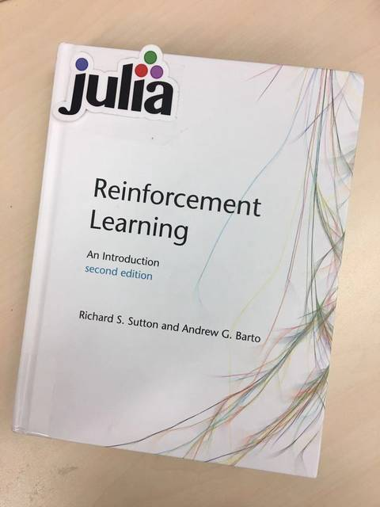

 "To think is to forget a difference, to generalize, to abstract."

― <a href="https://en.wikipedia.org/wiki/Jorge_Luis_Borges">Jorge Luis Borges</a>, <a href="https://en.wikipedia.org/wiki/Funes_the_Memorious">Funes the Memorious</a>

    

This project provides the [Julia](https://www.julialang.org/) code to generate figures in the book
[Reinforcement Learning: An
Introduction(2nd)](http://incompleteideas.net/book/the-book-2nd.html). One of
our main goals is to help users understand the basic concepts of reinforcement
learning from an engineer's perspective. Once you have grasped how different
components are organized, you're ready to explore a wide variety of modern deep
reinforcement learning algorithms in [ReinforcementLearningZoo.jl](https://github.com/JuliaReinforcementLearning/ReinforcementLearningZoo.jl).

## How to use?

### Play Interactively

For experienced users with the latest stable Julia properly installed:

1. Clone this project.
1. Start the Julia REPL: `julia --project=<path_to_this_project>`
1. Install dependencies: `] instantiate`
1. Launch [Pluto.jl](https://github.com/fonsp/Pluto.jl): `using Pluto; Pluto.run()`
1. Now you can see the Pluto page is opened in your browser. Paste
   `notebooks/Chapter01_Tic_Tac_Toe.jl` (or any other file under the `notebooks` folder) into
   the input box and click the `Open` button.

### Preview Notebooks

- [Chapter01 Tic Tac Toe.jl](https://juliareinforcementlearning.org/blog/notebooks_for_reinforcement_learning_an_introduction/Chapter01_Tic_Tac_Toe.jl)
- [Chapter02 Ten Armed Testbed.jl](https://juliareinforcementlearning.org/blog/notebooks_for_reinforcement_learning_an_introduction/Chapter02_Ten_Armed_Testbed.jl)
- [Chapter03 Grid World.jl](https://juliareinforcementlearning.org/blog/notebooks_for_reinforcement_learning_an_introduction/Chapter03_Grid_World.jl)
- [Chapter04 Car Rental.jl](https://juliareinforcementlearning.org/blog/notebooks_for_reinforcement_learning_an_introduction/Chapter04_Car_Rental.jl)
- [Chapter04 Gambler Problem.jl](https://juliareinforcementlearning.org/blog/notebooks_for_reinforcement_learning_an_introduction/Chapter04_Gambler_Problem.jl)
- [Chapter04 Grid World.jl](https://juliareinforcementlearning.org/blog/notebooks_for_reinforcement_learning_an_introduction/Chapter04_Grid_World.jl)
- [Chapter05 Blackjack.jl](https://juliareinforcementlearning.org/blog/notebooks_for_reinforcement_learning_an_introduction/Chapter05_Blackjack.jl)
- [Chapter05 Left Right.jl](https://juliareinforcementlearning.org/blog/notebooks_for_reinforcement_learning_an_introduction/Chapter05_Left_Right.jl)
- [Chapter06 Cliff Walking.jl](https://juliareinforcementlearning.org/blog/notebooks_for_reinforcement_learning_an_introduction/Chapter06_Cliff_Walking.jl)
- [Chapter06 Maximization Bias.jl](https://juliareinforcementlearning.org/blog/notebooks_for_reinforcement_learning_an_introduction/Chapter06_Maximization_Bias.jl)
- [Chapter06 RandomWalk.jl](https://juliareinforcementlearning.org/blog/notebooks_for_reinforcement_learning_an_introduction/Chapter06_RandomWalk.jl)
- [Chapter06 Windy Grid World.jl](https://juliareinforcementlearning.org/blog/notebooks_for_reinforcement_learning_an_introduction/Chapter06_Windy_Grid_World.jl)
- [Chapter07 Random Walk.jl](https://juliareinforcementlearning.org/blog/notebooks_for_reinforcement_learning_an_introduction/Chapter07_Random_Walk.jl)
- [Chapter08 Expectation VS Sample.jl](https://juliareinforcementlearning.org/blog/notebooks_for_reinforcement_learning_an_introduction/Chapter08_Expectation_VS_Sample.jl)
- [Chapter08 Maze.jl](https://juliareinforcementlearning.org/blog/notebooks_for_reinforcement_learning_an_introduction/Chapter08_Maze.jl)
- [Chapter08 Trajectory Sampling.jl](https://juliareinforcementlearning.org/blog/notebooks_for_reinforcement_learning_an_introduction/Chapter08_Trajectory_Sampling.jl)
- [Chapter09 Random Walk.jl](https://juliareinforcementlearning.org/blog/notebooks_for_reinforcement_learning_an_introduction/Chapter09_Random_Walk.jl)
- [Chapter10 Access Control.jl](https://juliareinforcementlearning.org/blog/notebooks_for_reinforcement_learning_an_introduction/Chapter10_Access_Control.jl)
- [Chapter10 Mountain Car.jl](https://juliareinforcementlearning.org/blog/notebooks_for_reinforcement_learning_an_introduction/Chapter10_Mountain_Car.jl)
- [Chapter11 Counter Example.jl](https://juliareinforcementlearning.org/blog/notebooks_for_reinforcement_learning_an_introduction/Chapter11_Counter_Example.jl)
- [Chapter12 Random Walk.jl](https://juliareinforcementlearning.org/blog/notebooks_for_reinforcement_learning_an_introduction/Chapter12_Random_Walk.jl)
- [Chapter13 Short Corridor.jl](https://juliareinforcementlearning.org/blog/notebooks_for_reinforcement_learning_an_introduction/Chapter13_Short_Corridor.jl)
